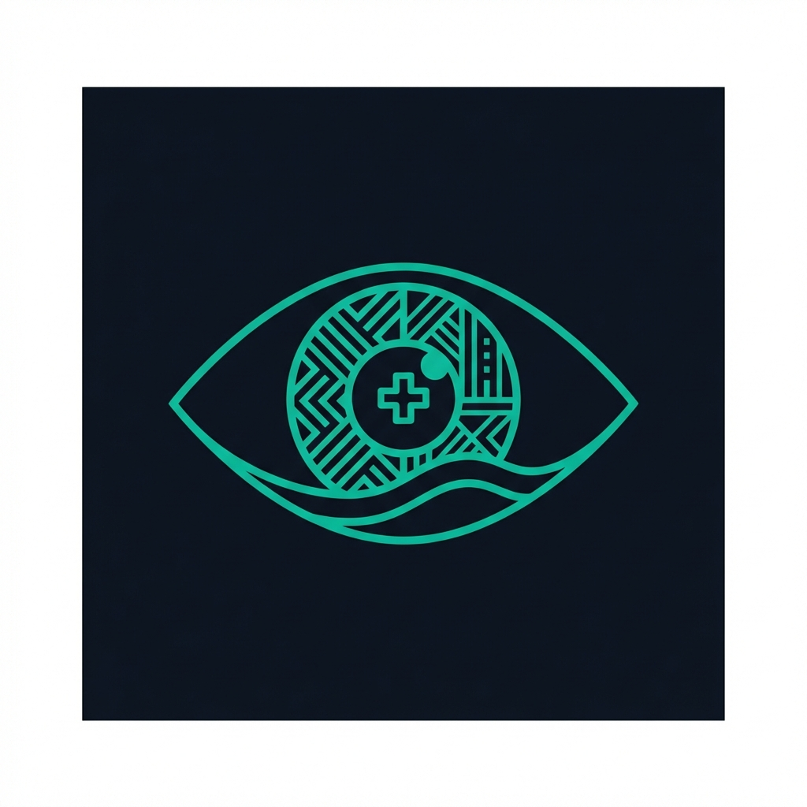

<p align="center">
  
</p>

<h1 align="center">Nku: Offline Medical AI for Pan-Africa</h1>

<p align="center">
  <strong>Nku Sentinel — Clinical Triage on $50 Phones</strong>
</p>

<p align="center">
  <a href="#features">Features</a> •
  <a href="#architecture">Architecture</a> •
  <a href="#quick-start">Quick Start</a> •
  <a href="#models">Models</a> •
  <a href="#languages">Languages</a> •
  <a href="./CONTRIBUTING.md">Contributing</a>
</p>

<p align="center">
  
  
  
  
  
</p>

---

## 🌍 The Problem

In rural Sub-Saharan Africa:
- **Physician-to-patient ratio exceeds 1:10,000**
- **450M+ people** lack accessible primary care screening
- **Unreliable rural connectivity** — cloud AI is impractical where 25% lack mobile broadband (ITU 2024)
- **Representation bias**: AI models perform poorly on Fitzpatrick V-VI skin tones

Yet **nearly all Community Health Workers (CHWs) carry smartphones**.

## 💡 The Solution

**Nku** ("eye" in Ewe) is designed to turn any $50-100 Android phone into an offline clinical triage engine. It is a **proof-of-concept edge system** — 100% on-device inference, zero cloud dependency for clinical reasoning.

| What | How |
|:-----|:----|
| **100% On-Device Medical Inference** | All clinical reasoning runs on-device — zero cloud dependency for MedGemma |
| **On-Device Translation** | ML Kit for 59 languages (incl. English, French, Portuguese) + Cloud Translate fallback for indigenous languages |
| **Ultra-Compressed** | 8GB → ~2.3GB via Q4_K_M quantization (56% MedQA on quantized model, vs. 69% unquantized) |
| **Pan-African Languages** | 46 languages including Ewe, Hausa, Yoruba, Swahili |
| **Budget Hardware** | Runs on $50–100 Android phones (3–4GB RAM, TECNO/Infinix) via mmap |
| **Camera Screening** | Heart rate, anemia, & preeclampsia via phone camera |

---

## ✨ Features

- 🧠 **MedGemma 4B** — Google's clinical reasoning model, quantized to ~2.3GB Q4_K_M (56% MedQA, quantized; 69% unquantized)
- 🌐 **Android ML Kit** — On-device translation for 59 languages + Cloud Translate fallback for indigenous African languages
- 🔊 **Android System TTS** — Device-native voice synthesis for spoken clinical results
- 💎 **Premium UI** — Glassmorphism design with localized strings
- ⚡ **Nku Cycle** — Memory-efficient mmap orchestration on budget devices (3–4GB RAM)
- 📷 **Nku Sentinel** — Camera-based screening for heart rate, anemia, & preeclampsia

---

## 🏗 Architecture

```
┌─────────────────────────────────────────────────────────────┐
│                    THE NKU CYCLE                            │
├─────────────────────────────────────────────────────────────┤
│                                                             │
│   [Patient Symptom in Ewe / Camera Screening]              │
│           ↓                                                 │
│   ┌───────────────────┐                                    │
│   │  Android ML Kit   │  ← On-device (~30MB/lang)           │
│   │  Local → English  │  or Cloud Translate fallback        │
│   └────────┬──────────┘                                    │
│            ↓                                                │
│   ┌───────────────────┐                                    │
│   │    MedGemma 4B    │  ← Q4_K_M (2.3GB) • 100% on-device │
│   │  Clinical Triage  │                                    │
│   └────────┬──────────┘                                    │
│            ↓                                                │
│   ┌───────────────────┐                                    │
│   │  Android ML Kit   │                                    │
│   │  English → Local  │                                    │
│   └────────┬──────────┘                                    │
│            ↓                                                │
│   ┌───────────────────┐                                    │
│   │  Android System TTS │                                    │
│   │  Spoken Result    │                                    │
│   └───────────────────┘                                    │
│                                                             │
└─────────────────────────────────────────────────────────────┘
```

### Nku Sentinel — Camera-Based Screening

| Screening | Module | Method | Output |
|:----------|:-------|:-------|:-------|
| **Cardio Check** | `RPPGProcessor.kt` | Green channel DFT (30fps) | Heart rate ±5 BPM |
| **Anemia Screen** | `PallorDetector.kt` | Conjunctival HSV analysis | Pallor severity (0-1) |
| **Preeclampsia** | `EdemaDetector.kt` | Facial geometry (EAR + gradients) | Edema severity (0-1) |
| **Triage** | `ClinicalReasoner.kt` | MedGemma + WHO/IMCI fallback | Severity & recommendations |

All screening uses **pure signal processing** (0 MB additional weights). Sensor outputs are aggregated by `SensorFusion.kt` and interpreted by MedGemma for clinical reasoning.

### Fitzpatrick-Aware Design

- **Pallor**: Conjunctiva-only analysis — consistent across all skin tones
- **Edema**: Geometry-based ratios — skin-color independent
- **Heart Rate**: Adaptive multi-frame averaging

### Tech Stack

| Layer | Technology |
|:------|:-----------|
| **UI** | Jetpack Compose (Glassmorphism) |
| **Perception** | RPPGProcessor, PallorDetector, EdemaDetector |
| **Orchestration** | ClinicalReasoner + SensorFusion + ThermalManager (42°C) |
| **Security** | PromptSanitizer (6-layer injection protection at every model boundary) |
| **Inference** | llama.cpp via JNI (NDK 29, ARM64 NEON) |
| **Translation** | Android ML Kit (on-device) + Google Cloud Translate (fallback) |
| **TTS** | Android System TTS (NkuTTS.kt) |
| **Quantization** | Q4_K_M (56% MedQA quantized, 81% of 69% unquantized baseline); imatrix used for IQ2_XS study |

---

## 🚀 Quick Start

### Prerequisites

- Android SDK 35+
- NDK 29.0.13113456
- Kotlin 2.1.0
- ~4GB free storage for models

### Build the App

```bash
# Clone the repository
git clone https://github.com/Elormyevu/nku-medgemma-conversion.git
cd nku-medgemma-conversion/mobile/android

# Build debug APK
./gradlew assembleDebug

# Install to device
adb install -r app/build/outputs/apk/debug/app-debug.apk
```

### Download Models

Models are loaded from device storage. For production, see `MODEL_DISTRIBUTION.md` for Play Asset Delivery integration.

```bash
# Download MedGemma Q4_K_M from HuggingFace
huggingface-cli download mradermacher/medgemma-4b-it-GGUF medgemma-4b-it-Q4_K_M.gguf

# Push to device (development)
adb push medgemma-4b-it-Q4_K_M.gguf /sdcard/Download/

# ML Kit translation packs are downloaded automatically by the app
```

---

## 🧠 Models

### Compression Pipeline

We achieve **~71% model size reduction** (8GB → 2.3GB) while retaining clinically useful accuracy (56% MedQA on the quantized model, vs. 69% unquantized):

| Stage | Format | MedGemma | Total |
|:------|:------:|:--------:|:-----:|
| Original | F16 | ~8.0 GB | ~8 GB |
| Standard | Q4_K_M | 2.3 GB | 2.3 GB |
| **Production** | **Q4_K_M** | **~2.3 GB** | **~2.3 GB** |

*Translation handled by Android ML Kit (~30MB/language pack) — not a GGUF model.*

### Calibration

We created a **243-scenario African primary care calibration dataset** across 14+ African languages, used to generate an importance matrix for aggressive quantization experiments. The imatrix was used for IQ2_XS quantization (which outperformed Q2_K despite being smaller — see Appendix D). The deployed Q4_K_M model is a standard quantization from [mradermacher/medgemma-4b-it-GGUF](https://huggingface.co/mradermacher/medgemma-4b-it-GGUF).

```bash
# Generate calibration imatrix (used for IQ2_XS experiments)
./llama-imatrix -m medgemma-4b-f16.gguf \
  -f calibration/african_primary_care.txt \
  --chunks 64 \
  -o medgemma-medical.imatrix

# Quantize with imatrix (used for IQ2_XS — see Appendix D)
./llama-quantize medgemma-4b-f16.gguf medgemma-4b-IQ2_XS.gguf IQ2_XS \
  --imatrix medgemma-medical.imatrix
```

---

## 🌐 Languages

### Verified Core (14)
✅ English | ✅ French | ✅ Swahili | ✅ Hausa | ✅ Yoruba | ✅ Igbo | ✅ Amharic | ✅ Ewe | ✅ Twi | ✅ Wolof | ✅ Zulu | ✅ Xhosa | ✅ Oromo | ✅ Tigrinya

### Extended Pan-African Suite (32)
Afrikaans, Arabic, Bambara, Bemba, Chichewa, Dinka, Fula, Ga, Kikuyu, Kinyarwanda, Kongo, Kuanyama, Lingala, Luba-Kasai, Luo, Luganda, Malagasy, Ndebele, Northern Sotho, Nuer, Pidgin (Nigerian), Pidgin (Cameroonian), Portuguese, Rundi, Sesotho, Shona, Somali, Swati, Tsonga, Tswana, Tumbuka, Venda

### Verified Triage Results

| Language | Input | Diagnosis | Severity |
|:---------|:------|:----------|:--------:|
| Ewe | "Ta me dɔ nam" (My head hurts) | Malaria screen | Medium |
| Yoruba | Stomach/Head symptoms | Gastroenteritis | Medium |
| Hausa | Fever/Body Aches | Malaria Suspected | High |
| Swahili | Cough/Breathing | Pneumonia Suspected | High |
| English | Diarrhea/Weakness | Dehydration | Medium |

---

## 📁 Project Structure

```
nku-medgemma-conversion/
├── mobile/android/           # Android application (PRODUCTION CODE)
│   └── app/src/main/
│       ├── java/com/nku/app/
│       │   ├── MainActivity.kt         # UI + Compose
│       │   ├── NkuInferenceEngine.kt   # MedGemma orchestration
│       │   ├── NkuTranslator.kt        # ML Kit translation wrapper
│       │   ├── RPPGProcessor.kt        # Heart rate (rPPG)
│       │   ├── PallorDetector.kt       # Anemia (conjunctiva)
│       │   ├── EdemaDetector.kt        # Preeclampsia (edema)
│       │   ├── SensorFusion.kt         # Vital signs aggregator
│       │   ├── ClinicalReasoner.kt     # MedGemma + WHO fallback
│       │   ├── PromptSanitizer.kt      # 6-layer prompt injection defense
│       │   ├── ThermalManager.kt       # 42°C auto-throttle
│       │   ├── LocalizedStrings.kt     # 46-language UI strings
│       │   ├── NkuTTS.kt              # Android System TTS wrapper
│       │   ├── CameraPreview.kt       # Camera2 preview composable
│       │   ├── FaceDetectorHelper.kt  # MediaPipe face landmark wrapper
│       │   └── screens/               # Screen composables (Cardio, Anemia, Preeclampsia, Triage)
│       └── assets/           # App resources (models loaded from device storage)
├── cloud/                    # DEVELOPMENT BACKEND — optional Flask API used during prototyping.
│                             #   NOT part of the production Android app. Shares triage logic
│                             #   for validation. Retained as development artifact.
├── benchmark/                # Quantization model selection study — MedQA benchmarks
│                             #   for IQ1_M, Q2_K, IQ2_XS, Q4_K_M. Only Q4_K_M is deployed.
├── tests/                    # Python test suite (48 tests: API, security, integration, algorithms)
├── scripts/
│   ├── quantization/         # Q4_K_M quantization (see Appendix D)
│   ├── calibration/          # Medical imatrix generation
│   └── conversion/           # HF → GGUF conversion
├── calibration/              # Clinical calibration datasets
├── llama.cpp/                # Inference engine (submodule)
└── docs/                     # Documentation & assets
```

---

## 🏆 MedGemma Impact Challenge

This project is a submission for the [MedGemma Impact Challenge](https://www.kaggle.com/competitions/medgemma-impact-challenge) on Kaggle.

**Target Track**: Edge AI Prize ($5,000)

| Criterion | Our Strength |
|:----------|:-------------|
| **HAI-DEF Usage** | MedGemma 4B is core to all clinical reasoning |
| **Product Feasibility** | Full Android app, verified on emulator & device |
| **Problem Domain** | Clear unmet need: 450M+ underserved |
| **Impact Potential** | Pan-Africa, offline-first, budget hardware |

---

## 🤝 Contributing

We welcome contributions! See [CONTRIBUTING.md](./CONTRIBUTING.md) for guidelines.

**Priority Areas:**
- 🌍 Language model improvements for low-resource African languages
- ⚡ Inference optimization for ARM Mali/Adreno GPUs
- 🔬 Clinical validation with CHW partners
- 📱 UI/UX improvements for low-literacy users

---

## 📄 License

This project is licensed under the Apache License 2.0 — see the [LICENSE](./LICENSE) file for details.

**Model Licenses:**
- MedGemma: [Google Health AI Terms](https://aistudio.google.com/app/prompts/new_chat?model=medlm-1.5-4b)
- Android ML Kit: [Google APIs Terms of Service](https://developers.google.com/terms)

---

## 📚 References

- [MedGemma Model Card](https://huggingface.co/google/medgemma-4b)
- [llama.cpp](https://github.com/ggerganov/llama.cpp)
- [African Languages Dataset](https://huggingface.co/datasets/masakhane/masakhane)

---

<p align="center">
  <strong>🌍 450M+ lives • 💰 $50 phones • 🧠 100% on-device medical inference • 🗣️ 46 languages</strong>
</p>

<p align="center">
  Made with ❤️ for Pan-Africa
</p>
