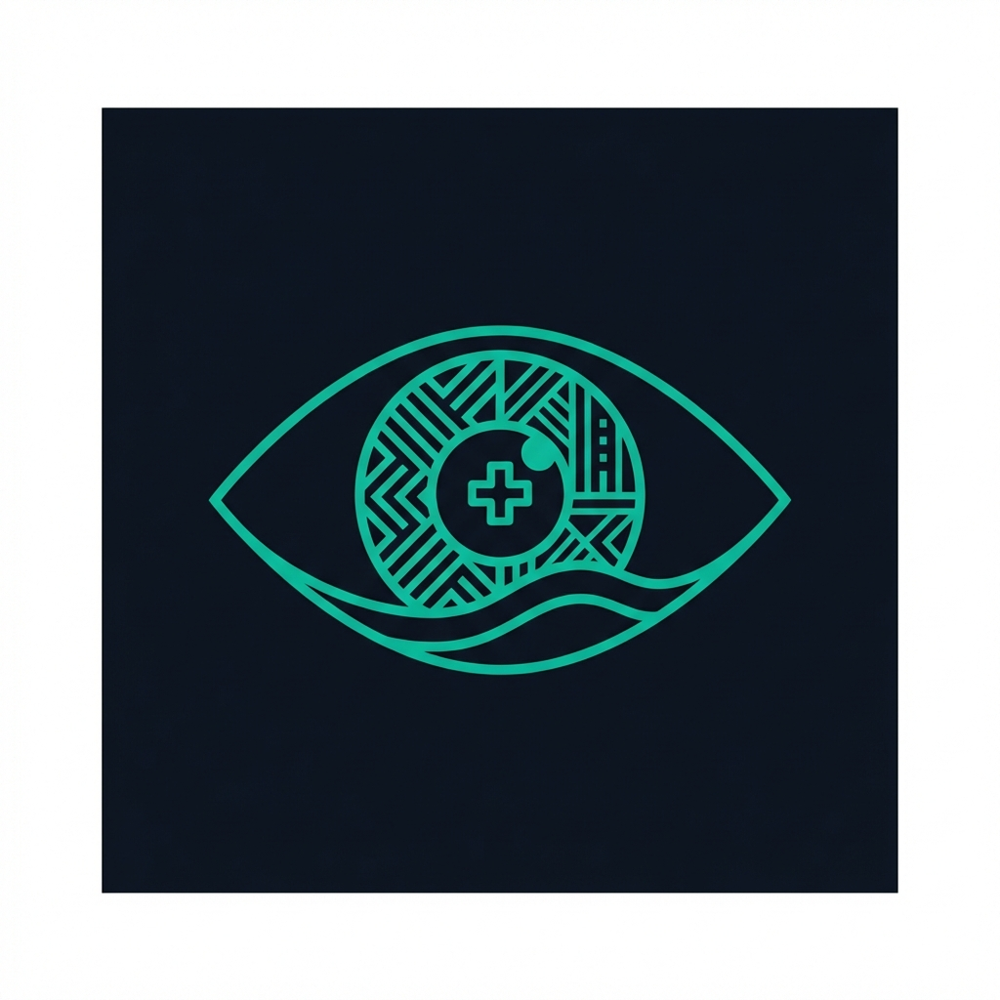

<p align="center">
  
</p>

<h1 align="center">Nku: Offline Medical AI for Pan-Africa</h1>

<p align="center">
  <strong>Nku Sentinel — Clinical Triage on $60–100 Phones</strong>
</p>

<p align="center">
  <a href="#features">Features</a> •
  <a href="#architecture">Architecture</a> •
  <a href="#quick-start">Quick Start</a> •
  <a href="#models">Models</a> •
  <a href="#languages">Languages</a> •
  <a href="./CONTRIBUTING.md">Contributing</a>
</p>

<p align="center">
  
  
  
  
  
</p>

---

## 🌍 The Problem

In rural Sub-Saharan Africa:
- **Physician-to-patient ratio exceeds 1:10,000**
- **450M+ people** lack accessible primary care screening
- **Unreliable rural connectivity** — cloud AI is impractical where 25% lack mobile broadband (ITU 2024)
- **Representation bias**: AI models perform poorly on Fitzpatrick V-VI skin tones

Yet **nearly all Community Health Workers (CHWs) carry smartphones**.

## 💡 The Solution

**Nku** ("eye" in Ewe) is designed to turn any $60+ Android phone into an offline clinical triage engine. It is a **proof-of-concept edge system** — 100% on-device inference, zero cloud dependency for clinical reasoning.

| What | How |
|:-----|:----|
| **100% On-Device Medical Inference** | All clinical reasoning runs on-device — zero cloud dependency for MedGemma |
| **On-Device Translation** | ML Kit for 59 languages (incl. English, French, Portuguese); unsupported languages pass through unchanged in offline mode |
| **Ultra-Compressed** | 8GB → ~2.3GB via Q4_K_M quantization (56% MedQA on quantized model, vs. 69% unquantized) |
| **Pan-African Languages** | 46 languages including Ewe, Hausa, Yoruba, Swahili |
| **Budget Hardware** | Runs on $60+ Android phones (3–4GB RAM, TECNO/Infinix) via mmap |
| **Camera + Mic Screening** | Heart rate, anemia, jaundice, preeclampsia via camera; TB/respiratory via HeAR Event Detector (1.1MB TFLite); ViT-L encoder upgrade path architecturally complete but blocked by XLA/StableHLO conversion |

---

## ✨ Features

- 🧠 **MedGemma 4B** — Google's clinical reasoning model, quantized to ~2.3GB Q4_K_M (56% MedQA, quantized; 69% unquantized)
- 🌐 **Android ML Kit** — On-device translation for 59 languages; unsupported languages pass through unchanged in offline mode
- 🔊 **Android System TTS** — Device-native voice synthesis for spoken clinical results
- 💎 **Premium UI** — Glassmorphism design with localized strings
- ⚡ **Nku Cycle** — Memory-efficient mmap orchestration on budget devices (3–4GB RAM)
- 📷 **Nku Sentinel** — Camera-based screening for heart rate, anemia, jaundice, & preeclampsia; microphone-based TB/respiratory screening via HeAR Event Detector (MobileNetV3, 1.1MB TFLite)

---

## 🏗 Architecture

```
┌─────────────────────────────────────────────────────────────┐
│                    THE NKU CYCLE                            │
├─────────────────────────────────────────────────────────────┤
│                                                             │
│   [Patient Symptom in Ewe / Camera Screening]              │
│           ↓                                                 │
│   ┌───────────────────┐                                    │
│   │  Android ML Kit   │  ← On-device (~30MB/lang)           │
│   │  Local → English  │  (or pass-through if unsupported)   │
│   └────────┬──────────┘                                    │
│            ↓                                                │
│   ┌───────────────────┐                                    │
│   │    MedGemma 4B    │  ← Q4_K_M (2.3GB) • 100% on-device │
│   │  Clinical Triage  │                                    │
│   └────────┬──────────┘                                    │
│            ↓                                                │
│   ┌───────────────────┐                                    │
│   │  Android ML Kit   │                                    │
│   │  English → Local  │                                    │
│   └────────┬──────────┘                                    │
│            ↓                                                │
│   ┌───────────────────┐                                    │
│   │  Android System TTS │                                    │
│   │  Spoken Result    │                                    │
│   └───────────────────┘                                    │
│                                                             │
└─────────────────────────────────────────────────────────────┘
```

### Nku Sentinel — Camera-Based Screening

| Screening | Module | Method | Output |
|:----------|:-------|:-------|:-------|
| **Cardio Check** | `RPPGProcessor.kt` | Green channel DFT (30fps) | Heart rate ±5 BPM |
| **Anemia Screen** | `PallorDetector.kt` | Conjunctival HSV analysis | Pallor severity (0-1) |
| **Jaundice Screen** | `JaundiceDetector.kt` | Scleral HSV analysis | Jaundice severity (0-1) |
| **Preeclampsia** | `EdemaDetector.kt` | Facial geometry (EAR + gradients) | Edema severity (0-1) |
| **TB/Respiratory** | `RespiratoryDetector.kt` | HeAR Event Detector (TFLite, 1.1MB, FP32 fallback) | Risk score (0-1) + health sound class distribution |
| **Triage** | `ClinicalReasoner.kt` | MedGemma + WHO/IMCI fallback | Severity & recommendations |

All screening uses **pure signal processing** (0 MB additional weights) except TB/respiratory which uses the HeAR Event Detector (MobileNetV3, 1.1MB TFLite with robust FP32 fallback, lazy-loaded on first inference). The HeAR Event Detector acts as the primary respiratory triage mechanism, classifying 8 distinct acoustic events to generate a synthetic respiratory risk score based on abnormal breathing patterns and cough prevalence.

The HeAR ViT-L encoder (∼1.2GB) is architecturally supported but **NOT SHIPPED** in the app — its XlaCallModule/StableHLO format cannot be converted to ONNX or TFLite by any current tool (see `ARCHITECTURE.md`). Sensor outputs are aggregated by `SensorFusion.kt` and interpreted by MedGemma for clinical reasoning.

### Fitzpatrick-Aware Design

- **Pallor**: Conjunctiva-only analysis — consistent across all skin tones
- **Jaundice**: Scleral tissue analysis — unpigmented, consistent across all skin tones
- **Edema**: Geometry-based ratios — skin-color independent
- **Heart Rate**: Adaptive multi-frame averaging

### Tech Stack

| Layer | Technology |
|:------|:-----------|
| **UI** | Jetpack Compose (Glassmorphism) |
| **Perception** | RPPGProcessor, PallorDetector, JaundiceDetector, EdemaDetector, RespiratoryDetector |
| **Orchestration** | ClinicalReasoner + SensorFusion + ThermalManager (42°C) |
| **Security** | PromptSanitizer (6-layer injection protection at every model boundary) |
| **Inference** | llama.cpp via JNI (NDK 29, ARM64 NEON) |
| **Translation** | Android ML Kit (on-device); pass-through for unsupported languages in current mobile build |
| **TTS** | Android System TTS (NkuTTS.kt) |
| **Quantization** | Q4_K_M (56% MedQA quantized, 81% of 69% unquantized baseline); imatrix used for IQ2_XS study |

---

## 🚀 Quick Start

> [!WARNING]
> **Reviewer/Auditor Notice**: Direct APK installations (`app-debug.apk` or `app-release-unsigned.apk`) do not contain the 2.3GB MedGemma model due to Android's 150MB APK size limit. **No manual setup is needed** — the app automatically downloads the model from HuggingFace on app startup (MainActivity creation), validates its SHA-256 checksum, and proceeds. Just install the APK, connect to Wi-Fi, and run a triage. For offline testing, sideload the GGUF model via `adb push` (see below).

### Prerequisites

- Android SDK 35+
- NDK 29.0.13113456
- Kotlin 2.1.0
- **~6GB free device/emulator storage** (APK ~1.2GB + MedGemma 2.3GB + runtime headroom)
- ~4GB free storage for models on development machine

### Build the App

```bash
# Clone the repository
git clone https://github.com/Elormyevu/nku-medgemma-conversion.git
cd nku-medgemma-conversion/mobile/android

# Build debug APK
./gradlew assembleDebug

# Install to device
adb install -r app/build/outputs/apk/debug/app-debug.apk
```

### Models

All inference models ship with the app via Play Asset Delivery (see `MODEL_DISTRIBUTION.md`). For development/testing, models can be sideloaded:

```bash
# Download MedGemma Q4_K_M from HuggingFace
# In mobile/android/medgemma/src/main/assets/
curl -L -o medgemma-4b-it-q4_k_m.gguf "https://huggingface.co/hungqbui/medgemma-4b-it-Q4_K_M-GGUF/resolve/main/medgemma-4b-it-q4_k_m.gguf?download=true"

# Expected: 8bcb19d3e363f7d1ab27f364032436fd702e735a6f479d6bb7b1cf066e76b443
shasum -a 256 medgemma-4b-it-q4_k_m.gguf

# Push to device (rename to match Kotlin constant)
adb push medgemma-4b-it.Q4_K_M.gguf /sdcard/Android/data/com.nku.app/files/Download/medgemma-4b-it-q4_k_m.gguf

# ML Kit translation packs are downloaded automatically by the app
```

---

## 🧠 Models

### Compression Pipeline

We achieve **~69% model size reduction** (8GB → 2.3GB) while retaining clinically useful accuracy (56% MedQA on the quantized model, vs. 69% unquantized):

| Stage | Format | MedGemma | Total |
|:------|:------:|:--------:|:-----:|
| Original | F16 | ~8.0 GB | ~8 GB |
| Standard | Q4_K_M | 2.3 GB | 2.3 GB |
| **Production** | **Q4_K_M** | **~2.3 GB** | **~2.3 GB** |

*Translation handled by Android ML Kit (~30MB/language pack) — not a GGUF model.*

### Calibration

We created a **243-scenario African clinical triage calibration dataset** across 14+ African languages, used to generate an importance matrix for aggressive quantization experiments. The imatrix was used for IQ2_XS quantization (which outperformed Q2_K despite being smaller — see Appendix D). The deployed Q4_K_M model is a standard quantization from [mradermacher/medgemma-4b-it-GGUF](https://huggingface.co/mradermacher/medgemma-4b-it-GGUF).

```bash
# Generate calibration imatrix (used for IQ2_XS experiments)
./llama-imatrix -m medgemma-4b-f16.gguf \
  -f calibration/african_primary_care.txt \
  --chunks 64 \
  -o medgemma-medical.imatrix

# Quantize with imatrix (used for IQ2_XS — see Appendix D)
./llama-quantize medgemma-4b-f16.gguf medgemma-4b-IQ2_XS.gguf IQ2_XS \
  --imatrix medgemma-medical.imatrix
```

---

## 🌐 Languages

### Verified Core (14)
✅ English | ✅ French | ✅ Swahili | ✅ Hausa | ✅ Yoruba | ✅ Igbo | ✅ Amharic | ✅ Ewe | ✅ Twi | ✅ Wolof | ✅ Zulu | ✅ Xhosa | ✅ Oromo | ✅ Tigrinya

### Extended Pan-African Suite (32)
Afrikaans, Arabic, Bambara, Bemba, Chichewa, Dinka, Fula, Ga, Kikuyu, Kinyarwanda, Kongo, Kuanyama, Lingala, Luba-Kasai, Luo, Luganda, Malagasy, Ndebele, Northern Sotho, Nuer, Pidgin (Nigerian), Pidgin (Cameroonian), Portuguese, Rundi, Sesotho, Shona, Somali, Swati, Tsonga, Tswana, Tumbuka, Venda

### Verified Triage Results

| Language | Input | Diagnosis | Severity |
|:---------|:------|:----------|:--------:|
| Ewe | "Ta me dɔ nam" (My head hurts) | Malaria screen | Medium |
| Yoruba | Stomach/Head symptoms | Gastroenteritis | Medium |
| Hausa | Fever/Body Aches | Malaria Suspected | High |
| Swahili | Cough/Breathing | Pneumonia Suspected | High |
| English | Diarrhea/Weakness | Dehydration | Medium |

---

## 📁 Project Structure

```
nku-medgemma-conversion/
├── mobile/android/           # Android application (PRODUCTION CODE)
│   └── app/src/main/
│       ├── java/com/nku/app/
│       │   ├── MainActivity.kt         # UI + Compose
│       │   ├── NkuInferenceEngine.kt   # MedGemma orchestration
│       │   ├── NkuTranslator.kt        # ML Kit translation wrapper
│       │   ├── RPPGProcessor.kt        # Heart rate (rPPG)
│       │   ├── PallorDetector.kt       # Anemia (conjunctiva)
│       │   ├── JaundiceDetector.kt     # Jaundice (scleral icterus)
│       │   ├── EdemaDetector.kt        # Preeclampsia (edema)
│       │   ├── RespiratoryDetector.kt  # TB/Respiratory (HeAR Event Detector; ViT-L = future upgrade)
│       │   ├── SensorFusion.kt         # Vital signs aggregator
│       │   ├── ClinicalReasoner.kt     # MedGemma + WHO fallback
│       │   ├── PromptSanitizer.kt      # 6-layer prompt injection defense
│       │   ├── ThermalManager.kt       # 42°C auto-throttle
│       │   ├── LocalizedStrings.kt     # 46-language UI strings
│       │   ├── NkuTTS.kt              # Android System TTS wrapper
│       │   ├── CameraPreview.kt       # Camera2 preview composable
│       │   ├── FaceDetectorHelper.kt  # MediaPipe face landmark wrapper
│       │   └── screens/               # Screen composables (Cardio, Anemia, Jaundice, Preeclampsia, Respiratory, Triage)
│       └── assets/           # HeAR Event Detector TFLite (1.1MB); large models via PAD asset packs
├── cloud/                    # DEVELOPMENT BACKEND — optional Flask API used during prototyping.
│                             #   NOT part of the production Android app. Shares triage logic
│                             #   for validation. Retained as development artifact.
├── benchmark/                # Quantization model selection study — MedQA benchmarks
│                             #   for IQ1_M, Q2_K, IQ2_XS, Q4_K_M. Only Q4_K_M is deployed.
├── tests/                    # Python test suite (48 tests: API, security, integration, algorithms)
├── scripts/
│   ├── quantization/         # Q4_K_M quantization (see Appendix D)
│   ├── calibration/          # Medical imatrix generation
│   └── conversion/           # HF → GGUF conversion
├── calibration/              # Clinical calibration datasets
├── llama.cpp/                # Inference engine (submodule)
└── docs/                     # Documentation & assets
```

---

## 🏆 MedGemma Impact Challenge

This project is a submission for the [MedGemma Impact Challenge](https://www.kaggle.com/competitions/med-gemma-impact-challenge) on Kaggle.

**Target Track**: Edge AI Prize

| Criterion | Our Strength |
|:----------|:-------------|
| **HAI-DEF Usage** | MedGemma 4B is core to all clinical reasoning |
| **Product Feasibility** | Full Android app, verified on emulator & device |
| **Problem Domain** | Clear unmet need: 450M+ underserved |
| **Impact Potential** | Pan-Africa, offline-first, budget hardware |

---

## 🤝 Contributing

We welcome contributions! See [CONTRIBUTING.md](./CONTRIBUTING.md) for guidelines.

**Priority Areas:**
- 🌍 Language model improvements for low-resource African languages
- ⚡ Inference optimization for ARM Mali/Adreno GPUs
- 🔬 Clinical validation with CHW partners
- 📱 UI/UX improvements for low-literacy users

---

## 📄 License

**Nku is fully open source.** All application source code, build scripts, calibration data, and quantization artifacts are free to download, fork, modify, and use with attribution. Apache 2.0 is compatible with the MedGemma Impact Challenge's CC BY 4.0 requirement (Apache 2.0 is strictly more permissive).

| Component | License |
|:----------|:--------|
| Application source code, scripts, calibration data | [Apache License 2.0](./LICENSE) |
| MedGemma model weights | [Google Gemma Terms of Use](https://ai.google.dev/gemma/terms) |
| Android ML Kit | [Google APIs Terms of Service](https://developers.google.com/terms) |

---

## 📚 References

- [MedGemma Model Card](https://huggingface.co/google/medgemma-4b)
- [llama.cpp](https://github.com/ggerganov/llama.cpp)
- [African Languages Dataset](https://huggingface.co/datasets/masakhane/masakhane)

---

<p align="center">
  <strong>🌍 450M+ lives • 💰 $60+ phones • 🧠 100% on-device medical inference • 🗣️ 46 languages</strong>
</p>

<p align="center">
  Made with ❤️ for Pan-Africa
</p>
