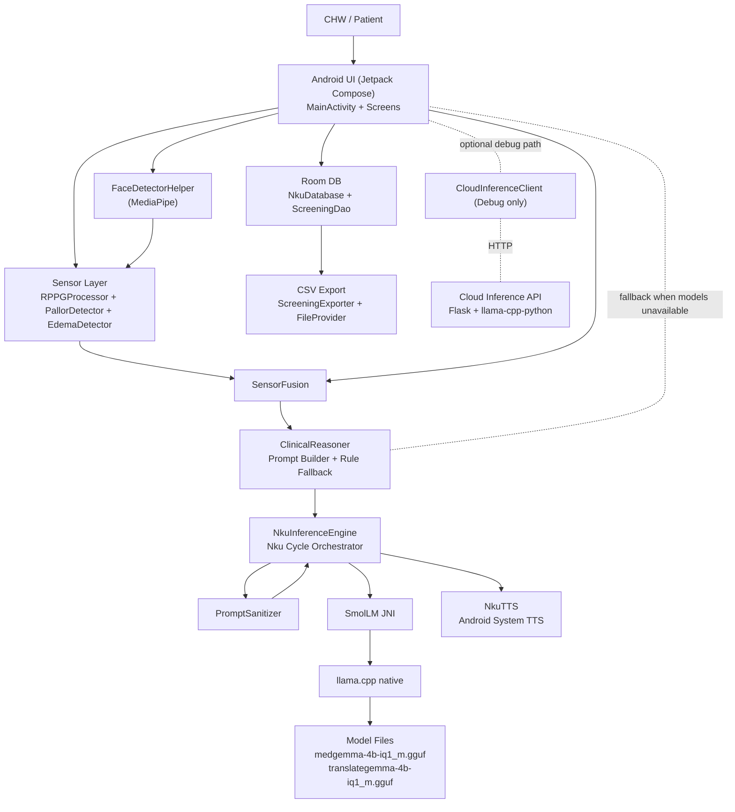

# Nku Comprehensive Product Audit Report

Date: 2026-02-11  
Repository: `1411ea8` on `main`  
Scope: Android frontend, backend API, performance/efficiency, security (including prompt injection), architecture, docs/spec conformance, QA/ops readiness

---

## 1) Current Project Status (High-Level)

### Delivery Status
- `Android app`: Core UI, sensor modules, triage flow, persistence/export, and native llama.cpp bridge are implemented.
- `Cloud backend`: Flask inference API with validation, rate limiting, logging, and deployment scripts is implemented.
- `Testing`: Python backend/security test suite executes successfully in scoped mode (`48 passed`), but full repo-wide test discovery is unstable.
- `Submission docs`: Extensive writeups and architecture docs exist, but multiple implementation-vs-doc drifts are present.

### Readiness Verdict
- **Not yet at “works exactly as described” state**.
- Primary blocker: **documented MedGemma on-device path is not currently operational in this repository state**.

---

## 2) Three-Pass Audit Execution

### Pass 1: Static Architecture + Spec Conformance
- Reviewed Android app code (`mobile/android/app/src/main/java/...`), backend (`cloud/inference_api/...`), docs (`README.md`, `kaggle_submission_writeup.md`, `technical_overview_3page.md`, `docs/ARCHITECTURE.md`), and submission assets.
- Mapped claimed architecture to implemented architecture and identified drift points.

### Pass 2: Executable Validation
- `python3 -m pytest -q tests` -> **48 passed**.
- `python3 -m pytest -q` -> **fails** during collection because nested `llama.cpp` test trees conflict with top-level `tests` package naming.
- `./gradlew test` in `mobile/android` -> **cannot execute in this environment** (`Unable to locate a Java Runtime`).

### Pass 3: Focused Security + Performance Deep-Dive
- Prompt-injection boundary testing against cloud validators and prompt templates.
- Endpoint contract checks between `CloudInferenceClient` and backend routes.
- Android privacy/permission/config review and hot-path CPU/memory analysis for camera/signal processing path.

---

## 3) Findings (Ordered by Severity)

## Critical

### C-01: On-device MedGemma path is non-functional in current repo state
- `NkuInferenceEngine` requires internal files `medgemma-4b-iq1_m.gguf` and `translategemma-4b-iq1_m.gguf` in app internal `filesDir/models` (`mobile/android/app/src/main/java/com/nku/app/NkuInferenceEngine.kt:54`, `mobile/android/app/src/main/java/com/nku/app/NkuInferenceEngine.kt:55`, `mobile/android/app/src/main/java/com/nku/app/NkuInferenceEngine.kt:69`, `mobile/android/app/src/main/java/com/nku/app/NkuInferenceEngine.kt:75`).
- Model extraction helper exists but is not invoked from app lifecycle (`mobile/android/app/src/main/java/com/nku/app/NkuInferenceEngine.kt:335`; no call in `mobile/android/app/src/main/java/com/nku/app/MainActivity.kt:80` onward).
- PAD asset-pack directories contain only README placeholders, not model files (`mobile/android/medgemma/src/main/assets/README.md:1`, `mobile/android/translategemma/src/main/assets/README.md:1`).
- Result: runtime likely falls back to rule-based path instead of MedGemma, conflicting with core submission claims.

### C-02: Prompt pipeline misuse can corrupt clinical prompting when models are available
- App passes a prebuilt structured English prompt into `runNkuCycle` (`mobile/android/app/src/main/java/com/nku/app/MainActivity.kt:287`, `mobile/android/app/src/main/java/com/nku/app/MainActivity.kt:288`).
- `runNkuCycle` sanitizes entire input (`mobile/android/app/src/main/java/com/nku/app/NkuInferenceEngine.kt:170`), and sanitizer strips tokens like `SEVERITY:`, `URGENCY:`, etc. (`mobile/android/app/src/main/java/com/nku/app/PromptSanitizer.kt:58`, `mobile/android/app/src/main/java/com/nku/app/PromptSanitizer.kt:59`, `mobile/android/app/src/main/java/com/nku/app/PromptSanitizer.kt:60`, `mobile/android/app/src/main/java/com/nku/app/PromptSanitizer.kt:61`).
- Also, selected UI language is used as translation source/target control (`mobile/android/app/src/main/java/com/nku/app/MainActivity.kt:290`; translation-to-English branch triggers when language != `en` at `mobile/android/app/src/main/java/com/nku/app/NkuInferenceEngine.kt:174`).
- Risk: distorted prompts and unstable MedGemma behavior under non-English UI selection.

### C-03: Cloud fallback contract is broken end-to-end
- Client sends `/triage` payload field `prompt` and reads `response/text` (`mobile/android/app/src/main/java/com/nku/app/CloudInferenceClient.kt:74`, `mobile/android/app/src/main/java/com/nku/app/CloudInferenceClient.kt:90`).
- Backend `/triage` requires `symptoms` and returns `assessment` (`cloud/inference_api/main.py:439`, `cloud/inference_api/main.py:481`).
- Client sends translation keys `source_language/target_language` (`mobile/android/app/src/main/java/com/nku/app/CloudInferenceClient.kt:129`, `mobile/android/app/src/main/java/com/nku/app/CloudInferenceClient.kt:130`) but backend reads `source/target` (`cloud/inference_api/main.py:374`, `cloud/inference_api/main.py:375`).
- Manifest has no `INTERNET` permission (camera/audio only), preventing network path on Android (`mobile/android/app/src/main/AndroidManifest.xml:6`, `mobile/android/app/src/main/AndroidManifest.xml:9`).

### C-04: Prompt-injection protections are bypassable on cloud path
- User-supplied delimiter token `<<<USER_INPUT>>>` is currently allowed by validator and inserted unescaped into prompt templates (`cloud/inference_api/security.py:217`, `cloud/inference_api/security.py:239`, `cloud/inference_api/security.py:273`).
- `PromptProtector.validate_output` accepts almost any non-empty output and mainly strips delimiter (`cloud/inference_api/security.py:281` onward), allowing instruction leakage patterns to pass.
- Practical reproduction in audit execution: validator accepted delimiter-including payload and produced prompt with 3 delimiter boundaries.

## High

### H-01: Preeclampsia capture path lacks runtime camera permission gate
- Cardio/Anemia explicitly request camera permission, but Preeclampsia screen capture starts directly (`mobile/android/app/src/main/java/com/nku/app/screens/PreeclampsiaScreen.kt:188`).
- Likely runtime failure/blank UX on denied permission cases.

### H-02: Sensitive medical data can be included in Android backups
- App sets `android:allowBackup="true"` (`mobile/android/app/src/main/AndroidManifest.xml:17`).
- Combined with local screening DB, this increases unintended data exfiltration risk.

### H-03: Persisted/exported clinical record is structurally incomplete
- Entity includes `symptoms`, `recommendations`, `edemaRiskFactors` (`mobile/android/app/src/main/java/com/nku/app/data/ScreeningEntity.kt:30`, `mobile/android/app/src/main/java/com/nku/app/data/ScreeningEntity.kt:33`, `mobile/android/app/src/main/java/com/nku/app/data/ScreeningEntity.kt:34`).
- Insert paths do not populate these fields (`mobile/android/app/src/main/java/com/nku/app/MainActivity.kt:297`, `mobile/android/app/src/main/java/com/nku/app/MainActivity.kt:313`).
- Export advertises those columns (`mobile/android/app/src/main/java/com/nku/app/data/ScreeningExporter.kt:39`), but generated rows are frequently blank.

### H-04: Request logging can report wrong HTTP status
- Logging wrapper assumes object with `status_code`; Flask tuple responses default to logged `200` (`cloud/inference_api/logging_config.py:141`).
- This distorts operational monitoring and incident triage.

### H-05: Default repo-wide Python test invocation is unstable
- `python3 -m pytest -q` fails in collection due duplicate/embedded `llama.cpp` test modules and missing optional deps.
- CI mitigates by scoping tests, but local default developer path is brittle.

## Medium

### M-01: Language support claim is overstated in UI behavior
- `supportedLanguages` lists 46 codes (`mobile/android/app/src/main/java/com/nku/app/LocalizedStrings.kt:17`).
- `forLanguage()` only maps Tier-1 set; many codes fall back to English (`mobile/android/app/src/main/java/com/nku/app/LocalizedStrings.kt:76`, `mobile/android/app/src/main/java/com/nku/app/LocalizedStrings.kt:90`).
- This conflicts with broad “localized strings across 46 languages” claims in docs (`README.md:48`, `README.md:231`, `technical_overview_3page.md:46`).

### M-02: Documentation drift creates deployment ambiguity
- `docs/ARCHITECTURE.md` states Android minimum API 26 (`docs/ARCHITECTURE.md:15`) while app requires minSdk 28 (`mobile/android/app/build.gradle:25`).
- `mobile/README.md` references legacy files not present in current codebase (`mobile/README.md:22`, `mobile/README.md:23`, `mobile/README.md:24`, `mobile/README.md:25`).

### M-03: Destructive migration fallback risks silent data loss
- Room DB builder includes `fallbackToDestructiveMigration()` (`mobile/android/app/src/main/java/com/nku/app/data/NkuDatabase.kt:41`).

### M-04: CameraPreview lifecycle can leak executor threads
- Creates `Executors.newSingleThreadExecutor()` (`mobile/android/app/src/main/java/com/nku/app/MainActivity.kt:348`) with no disposal hook in composable lifecycle.

### M-05: Per-frame image handling still has expensive hot-paths
- `ImageProxy -> Bitmap` conversion every analyzed frame (`mobile/android/app/src/main/java/com/nku/app/MainActivity.kt:393`).
- Edema eye/cheek analysis still calls `bitmap.getPixel()` in loops (`mobile/android/app/src/main/java/com/nku/app/EdemaDetector.kt:324`).

### M-06: CORS/API-key header mismatch for browser clients
- Server expects `X-API-Key` (`cloud/inference_api/main.py:105`) but configured CORS allow-headers omit it (`cloud/inference_api/security.py:546`).
- If browser clients are introduced, auth preflight will fail unless config updated.

## Low

### L-01: Partial localization gaps remain in UI text
- Examples of hardcoded English text in screens (`mobile/android/app/src/main/java/com/nku/app/screens/CardioScreen.kt:165`, `mobile/android/app/src/main/java/com/nku/app/screens/TriageScreen.kt:162`, `mobile/android/app/src/main/java/com/nku/app/screens/PreeclampsiaScreen.kt:202`).

### L-02: Cloud client path appears dead/unintegrated in app flow
- `CloudInferenceClient` exists but no call sites in app runtime flow were found outside its own file.

---

## 4) Conformance to Submission/Writeup Claims

### Claims That Are Partially Supported
- Offline-first architecture: **mostly supported** (release cloud URL blank, no INTERNET permission, local processing paths exist).
- Sensor modules (rPPG/pallor/edema): **implemented and wired**.
- Rule-based fallback triage: **implemented and reachable**.

### Claims Not Fully Met in Current Repo State
- “MedGemma is core to all clinical reasoning” / “verified end-to-end on device”: **not currently demonstrable** due model loading path and packaging gaps (C-01/C-02).
- “46-language localized UI”: **not fully true in behavior** (M-01).
- Cloud fallback dev path: **currently non-operational** due contract mismatch and manifest/network constraints (C-03).

### Verdict
- **The app does not currently verify as “exactly as described/intended” by submission docs.**

---

## 5) Architecture Map (Mermaid)

Mermaid source file: `audit_artifacts/2026-02-11/architecture_map.mmd`

---

## 6) Verification Evidence

### Commands Executed
- `python3 -m pytest -q tests` -> `48 passed in 120.67s`
- `python3 -m pytest -q` -> collection errors due duplicate nested test trees and optional deps
- `./gradlew test` (in `mobile/android`) -> failed in this environment: Java runtime missing
- Targeted runtime checks confirmed:
  - Cloud `/triage` rejects client-style `prompt` payload (`missing required fields: symptoms`)
  - Prompt validator accepts delimiter-injection payload with `<<<USER_INPUT>>>`

### Coverage Caveats
- Could not execute Android unit/instrumented tests in this environment due missing JRE/Android runtime.
- Could not validate real-device thermal/perf behavior without device/emulator execution.
- Could not run full dependency CVE scan locally (tooling/environment constraints), though repo has CI workflows for this.

---

## 7) Priority Fix Order (Risk-First)

1. Restore deterministic MedGemma path (model packaging + extraction/load call + health check in UI).  
2. Correct NkuCycle prompt flow (don’t sanitize full generated system prompt; separate user symptom sanitization from system instructions).  
3. Fix cloud fallback contract alignment (request/response schema + Android INTERNET permission if debug path is required).  
4. Harden prompt-injection defenses (delimiter escaping, stronger output validation, adversarial tests).  
5. Close privacy/compliance gaps (`allowBackup`, record completeness, migration strategy).  
6. Resolve doc drift and language coverage truthfulness.

